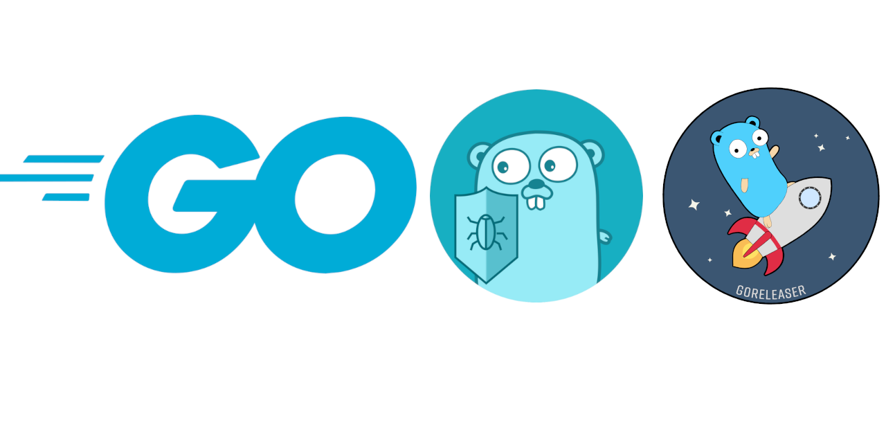

# {{project.name.full}}

---

<!-- ==START TEMPLATE README== -->

<p align="center">
    
</p>

## Description

This repository is a starter template for Golang projects using the latest version of Go. 
Use it to create command-line applications, web apps, and more.

It includes:

- configuration and workflow for `goreleaser`, a tool for building and publishing Go binaries.
- configuration for `golangci-lint`, a tool for Go that runs many linters in parallel.
- configuration for `task`, a tool similar to `make`. To download `task`, see the [task project page](https://github.com/go-task/task/).

Also included is a configuration and workflow for Dependabot, a tool for keeping dependencies up to date. 
Dependencies are updated automatically and pull requests are created to merge the changes; minor and patch version updates are automatically merged.

## Template Setup

To configure, run:

```bash
go run tools/configure-project.go
```

The configure script will ask you a series of questions that will customize the template with values such as your name, GitHub username, email address, use of optional packages, and more.

Some of the default values are automatically determined based on your git configuration, but you may change any of the values when prompted.

<!-- ==END TEMPLATE README== -->

{{project.description}}

## Setup

```bash
go mod tidy
```


## Building the project

```bash
task build
```

---

## Changelog

Please see [CHANGELOG](CHANGELOG.md) for more information on what has changed recently.

## Contributing

Please see [CONTRIBUTING](.github/CONTRIBUTING.md) for details.

## Security Vulnerabilities

Please review [our security policy](../../security/policy) on how to report security vulnerabilities.

## Credits

- [{{project.author.name}}](https://github.com/{{project.author.github}})
- [All Contributors](../../contributors)

## License

The MIT License (MIT). Please see [License File](LICENSE) for more information.
