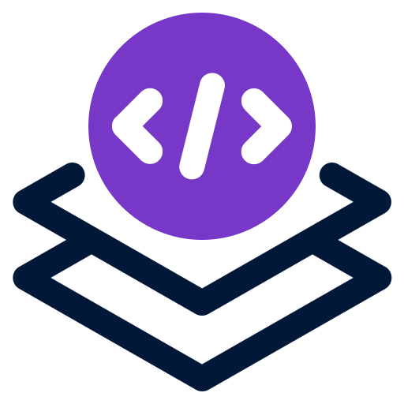

<p align="center">
    
</p>

# StackUp

---

a single application to spin up your entire dev stack.

## About Stackup

The application we've developed is a comprehensive tool designed to manage your entire development stack. It's a one-stop solution that brings together all the elements of your development environment, providing a unified interface to control and monitor each component.

One of the key features of this application is its ability to automate routine tasks. With a simple configuration, you can define a sequence of tasks that your projects require, such as starting containers, running database migrations, or seeding data. This automation not only saves you time but also ensures consistency across your development environment.

It also includes a robust precondition system. Before running tasks or starting servers, checks are performed to ensure everything is set up correctly. This feature helps prevent common issues that can occur when the environment is not properly configured.

In essence, this application is designed to streamline your development process. It takes care of the repetitive and mundane aspects of setting up and managing a development environment, allowing you to focus on what truly matters - writing great code. Whether you're a solo developer or part of a large team, this application can significantly enhance your productivity and efficiency.

## Configuration

The application is configured using a YAML file. This file contains a list of tasks that the application should perform, as well as a list of servers that the application should start. The file also contains a list of preconditions that must be met before the application can run.

### Configuration: Preconditions

The `preconditions` section of the configuration file is used to specify a list of conditions that must be met before the application can run. Each precondition is defined by a `name` and a `check`. The `name` is a human-readable description of the precondition, and the `check` is a javascript expression that returns a boolean value indicating whether the precondition is met.

Here is an example of the `preconditions` section:

```yaml
preconditions:
    - name: frontend project exists
      check: exists(env("FRONTEND_PROJECT_PATH"))

    - name: backend project has docker-compose file
      check: exists(env("LOCAL_BACKEND_PROJECT_PATH") + "/docker-compose.yml")

    - name: backend project is laravel project
      check: exists(env("LOCAL_BACKEND_PROJECT_PATH") + "/artisan")
```

### Configuration: Tasks

The `tasks` section of the configuration file is used to specify a list of tasks that the application should perform. Tasks are run synchronously in the order they are defined, either on startup or shutdown. 

Each task is defined by a `name`, an optional `if` condition that is a javascript expression, a `cwd` that can be a javascript expression, an optional `silent` flag, an `on` condition that can be either `startup` or `shutdown`, and a `command`. 

Here is an example of the `tasks` section:

```yaml
tasks:
  - name: start containers
    command: podman-compose up -d
    on: startup

  - name: run migrations (rebuild db)
    if: hasFlag("seed")
    command: php artisan migrate:fresh --seed
    on: startup

  - name: run migrations (no seeding)
    if: '!hasFlag("seed")'
    command: php artisan migrate
    on: startup

  - name: stop containers
    message: Stopping containers...
    command: podman-compose down
    on: shutdown
```

### Configuration: Servers

The `servers` section of the configuration file is used to specify a list of servers processes that the application should start. Each server is defined by a name, a command, a cwd (current working directory), and an optional platforms field.

Note that the `command` values are wrapped in double braces, which indicates that they should be interpreted as script expressions.

```yaml
servers:
  - name: frontend-httpd
    command: node ./node_modules/.bin/next dev
    cwd: '{{ env("FRONTEND_PROJECT_PATH") }}'

  - name: horizon queue
    command: php artisan horizon
    cwd: '{{ env("LOCAL_BACKEND_PROJECT_PATH") }}'
    platforms: ['linux', 'darwin']

  - name: httpd
    command: php artisan serve
    cwd: '{{ env("LOCAL_BACKEND_PROJECT_PATH") }}'
```

### Configuration: Scheduler

The `scheduler` section of the configuration file is used to specify a list of tasks that the application should run on a schedule, separate from any event loop tasks. 
Each scheduled task is defined by a `name`, a `command`, and a `cron` string.

Here is an example of the `scheduler` section:

```yaml
scheduler:
    - name: say hello every 1 minute
      command: printf "hello world\n"
      cron: '0 */1 * * * *'

    - name: say goodbye every 30 seconds
      command: printf "goodbye\n"
      cron: '*/30 * * * * *'
```

Note that these cron schedules differ from the standard in that you must specify seconds as the first item, followed by the usual items (minute, hour, etc.).

## Available Functions

Many of the configuration fields can be defined using a javascript expression syntax.
To specify an expression to be evaluated, wrap the content in double braces: `{{ myfunc() }}`.

| Function  	| Arguments        	| Description                                                                	|
|-----------	|------------------	|----------------------------------------------------------------------------	|
| env()     	| name: string     	| returns the value of environment variable `name                             	|
| exists()  	| filename: string 	| returns true if `filename` exists, false otherwise                         	|
| hasFlag() 	| name: string     	| returns true if the flag `name` was specified when running the application 	|

## Setup

```bash
go mod tidy
```

## Building the project

```bash
task build
```

---

## Changelog

Please see [CHANGELOG](CHANGELOG.md) for more information on what has changed recently.

## Contributing

Please see [CONTRIBUTING](.github/CONTRIBUTING.md) for details.

## Security Vulnerabilities

Please review [our security policy](../../security/policy) on how to report security vulnerabilities.

## Credits

- [Patrick Organ](https://github.com/patinthehat)
- [All Contributors](../../contributors)

## License

The MIT License (MIT). Please see [License File](LICENSE) for more information.
